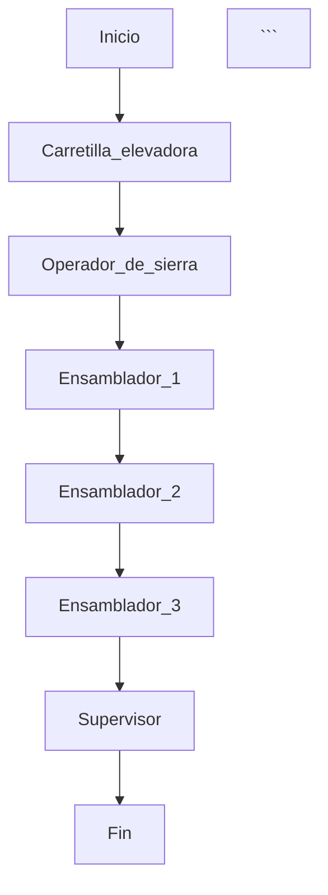

```mermaid
graph TD;
    Inicio --> Carretilla_elevadora;
    Carretilla_elevadora --> Operador_de_sierra;
    Operador_de_sierra --> Ensamblador_1;
    Ensamblador_1 --> Ensamblador_2;
    Ensamblador_2 --> Ensamblador_3;
    Ensamblador_3 --> Supervisor;
    Supervisor --> Fin;```

```

